## Table of contents
## 1. Giới thiệu 
Trong Python, **vòng lặp (loop)** là một cấu trúc điều khiển cho phép thực hiện lặp đi lặp lại một khối lệnh cho đến khi một điều kiện nào đó không còn đúng. Có hai loại vòng lặp chính trong Python: `for` và `while`.
- Vòng lặp `for` thường được dùng để lặp qua một dãy các phần tử như danh sách (`list`), chuỗi (`string`), hay phạm vi số (`range`). 
    
- Vòng lặp `while` thực hiện khối lệnh miễn là điều kiện còn đúng. Điều này có nghĩa là nó có thể lặp vô hạn nếu không được dừng bằng cách cập nhật điều kiện hoặc dùng lệnh `break`

Dưới đây là 1 ví dụ nếu không xài vòng lặp: 
```python
# in ra các số từ 1 đến 5
print(1)
print(2)
print(3)
print(4)
print(5)
```
Đoạn code trên vô cùng rườm rà so với khi có xài vòng lặp:
```python
# Vòng lặp for: in ra các số từ 1 đến 5
for i in range(1, 6):
    print(i)

# Vòng lặp while: đếm từ 1 đến 5
count = 1
while count <= 5:
    print(count)
    count += 1
```
## 2. Các mục  chính
### 2.1. Các lỗi phổ biến
20 lỗi phổ biến khi chúng ta lập trình: 
#### 2.1.1. NameError
`NameError` xảy ra khi chương trình cố gắng sử dụng một tên (biến, hàm, lớp...) chưa được khai báo trong phạm vi hiện tại. Đây là một lỗi phổ biến khi lập trình.
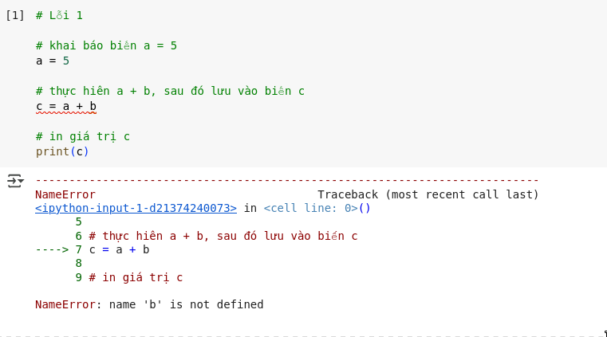
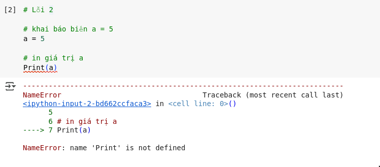
#### 2.1.2. SyntaxError
**`SyntaxError`** là một loại lỗi xảy ra khi trình thông dịch gặp phải mã nguồn không tuân theo cú pháp hợp lệ. Điều này có nghĩa là bạn đã viết mã theo cách mà Python không hiểu được. 
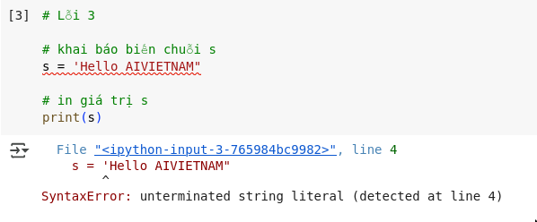
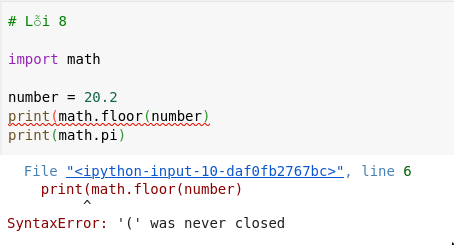
#### 2.1.3. ZeroDivisionError
**`ZeroDivisionError`** là một loại ngoại lệ (exception) xảy ra khi chương trình cố gắng chia một số cho **0**, điều này là không hợp lệ trong toán học.
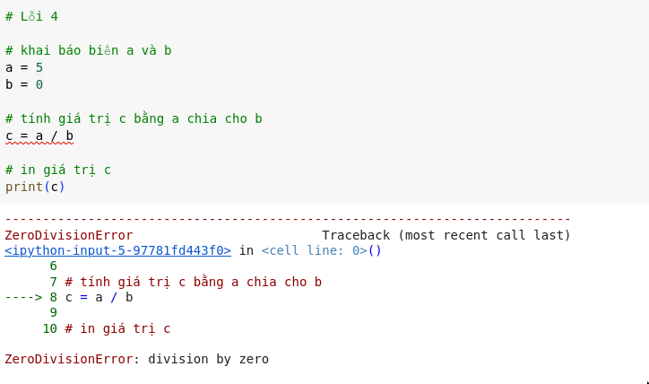
#### 2.1.4. TypeError
**TypeError** là một loại lỗi (exception) xảy ra khi bạn thực hiện một thao tác không hợp lệ giữa các kiểu dữ liệu không tương thích. Điều này thường gặp khi bạn cố gắng thực hiện các phép toán hoặc gọi hàm mà kiểu dữ liệu của đối tượng không phù hợp với yêu cầu của thao tác đó.
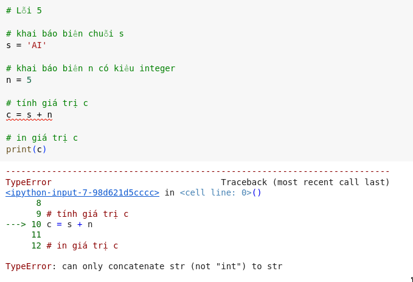
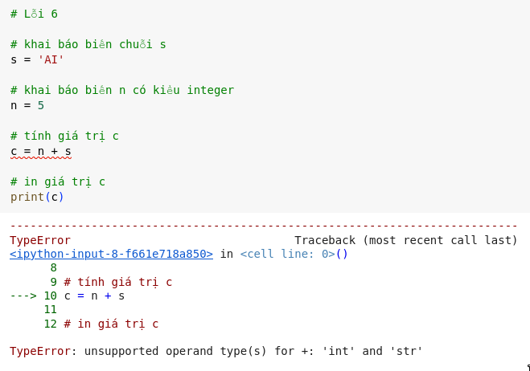
#### 2.1.5. IndentationError
**`IndentationError`** là một lỗi xảy ra khi đoạn mã không tuân thủ đúng quy tắc thụt lề vì Python sử dụng khoảng trắng hoặc tab để xác định khối lệnh. 
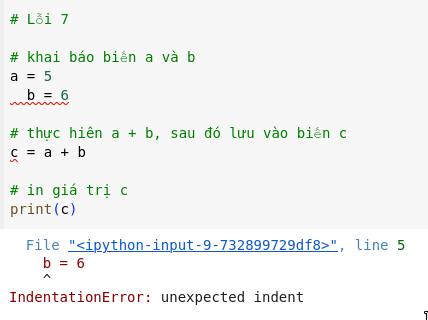
#### 2.1.6. ModuleNotFoundError
`ModuleNotFoundError` xảy ra khi trình thông dịch không thể tìm thấy một module mà bạn đang cố gắng import trong chương trình
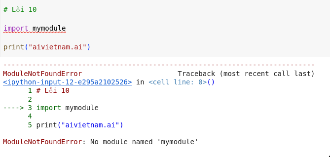
#### 2.1.7. IndexError
IndexError xuất hiện khi bạn cố gắng truy cập vào một chỉ số vượt quá phạm vi hợp lệ của cấu trúc dữ liệu. 
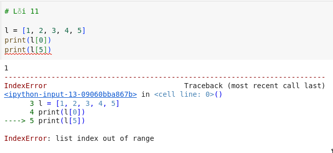
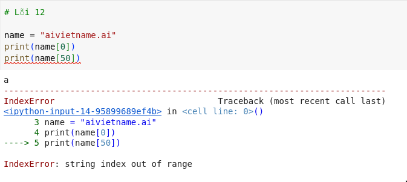
#### 2.1.8. KeyError
**`KeyError`** xảy ra khi bạn cố gắng truy cập một khóa (key) không tồn tại trong một đối tượng có kiểu dữ liệu dictionary.
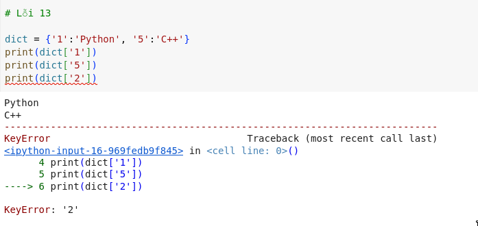
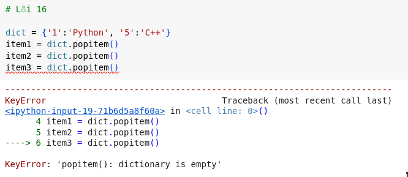
#### 2.1.9. ValueError
Lỗi ValueError xuất hiện khi một hàm hoặc toán tử nhận đối số có kiểu dữ liệu đúng, nhưng giá trị của đối số không nằm trong phạm vi được chấp nhận.
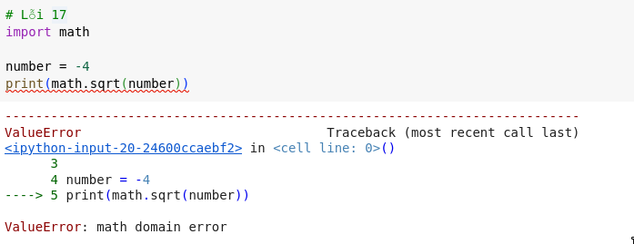
## 3. For Loops
**vòng lặp `for`** là một cấu trúc điều khiển cho phép lặp qua các phần tử của danh sách, chuỗi, tuple, hoặc bất kỳ tập hợp nào khác. Cú pháp cơ bản như sau: 
```python
for biến in iterable:
    khối_lệnh
```
Ở mỗi vòng lặp, `biến` sẽ lấy lần lượt từng giá trị từ `iterable`, và thực thi `khối_lệnh` với giá trị hiện tại đó.

### 3.1. Vòng lặp for trong comprehension
**Comprehension** bao gồm các kiểu dữ liệu như `list`, `dictionary`, `set`
#### 3.1.1. List comprehension
List comprehension tạo ra danh sách mới từ một dãy dữ liệu có sẵn (như list, tuple, range, v.v.) một cách **ngắn gọn, dễ đọc và hiệu quả** hơn so với cách dùng vòng lặp `for` thông thường.
```python
[expression for item in iterable if condition]
```
- `expression`: biểu thức áp dụng cho từng phần tử.
- `item`: tên biến đại diện cho mỗi phần tử trong `iterable`.
- `iterable`: một đối tượng có thể lặp (list, tuple, string, range, v.v.).
- `if condition`: (tuỳ chọn) điều kiện lọc. \

Ví dụ cơ bản: Bình phương các số
```python
squares = [x**2 for x in range(5)]
print(squares)  # [0, 1, 4, 9, 16]
```
Giải thích:

- for x in range(5): duyệt qua các số từ 0 đến 4.

- x ** 2: bình phương từng số. \

Thêm điều kiện lọc
```python
even_squares = [x**2 for x in range(10) if x % 2 == 0]
print(even_squares)  # [0, 4, 16, 36, 64]
```
Giải thích: Chỉ tính bình phương với các số chẵn (if x % 2 == 0).
#### 3.1.2. Dictionary comprehension
Dictionary comprehension cho phép ta tạo ra một từ điển mới bằng cách áp dụng một biểu thức chomỗi phần tử trong một iterable.
```python
{ key_expression : value_expression for item in iterable if condition }
```
Trong đó:
-  key_expression: Biểu thức cho khóa.
-  value_expression: Biểu thức cho giá trị.
-  item, iterable, và condition: Tương tự như trong list comprehension.
Ví dụ: Tạo dictionary với khóa là số và giá trị là bình phương của số đó.
#### 3.1.3. Vòng lặp for với continue
Lệnh continue được dùng khi muốn bỏ qua phần còn lại của mã lệnh trong lần lặp hiện tại và chuyển ngay đến lần lặp tiếp theo. Lưu ý là lệnh sẽ không thoát hoàn toàn khỏi vòng lặp mà chỉ bỏ qua các câu lệnh phía sau nó trong lần lặp đó. \

Cú pháp:
```python
for biến in phạm_vi:
    if điều_kiện:
        continue
    # Các câu lệnh khác


```
- biến: Biến đếm hoặc phần tử hiện tại trong vòng lặp.
- phạm_vi: Tập hợp các giá trị mà vòng lặp duyệt qua (ví dụ: danh sách, dãy số).
- điều_kiện: Điều kiện để quyết định có thực thi continue hay không. \ 

Ví dụ minh họa:
```python
for i in range(1, 6):
    if i == 3:
        continue
    print(i)
```
Kết quả:
```text
1
2
4
5
```
Giải thích:
- Vòng lặp for duyệt qua các số từ 1 đến 5.
- Khi i == 3, lệnh continue được thực thi, khiến chương trình bỏ qua câu lệnh print trong lần lặp đó và chuyển sang lần lặp tiếp theo (tức là i = 4).
- Do đó, giá trị 3 không được in ra.
#### 3.1.4. Vòng lặp for với break
Lệnh break được sử dụng để thoát ngay lập tức khỏi một vòng lặp (trong trường hợp này là vòng lặp for) trước khi vòng lặp hoàn thành toàn bộ các lần lặp của nó. Khi lệnh break được thực thi, chương trình sẽ ngay lập tức chuyển điều khiển ra khỏi vòng lặp và tiếp tục thực hiện các câu lệnh tiếp theo sau vòng lặp. Dưới đây là giải thích chi tiết về lệnh break trong vòng lặp for: \ 

Cú pháp 
```python
for (khởi_tạo; điều_kiện; bước_nhảy) {
    // Khối mã
    if (điều_kiện_break) {
        break;
    }
    // Các câu lệnh khác
}
```

- **Khởi tạo**: Thiết lập giá trị ban đầu cho biến đếm.
- **Điều kiện**: Kiểm tra xem vòng lặp có nên tiếp tục hay không.
- **Bước nhảy**: Cập nhật giá trị biến đếm sau mỗi lần lặp.
- **Điều kiện break**: Một điều kiện cụ thể mà khi thỏa mãn, lệnh break sẽ được gọi để thoát khỏi vòng lặp.

Ví dụ minh họa:
```python
for i in range(1, 10):
    if i == 5:
        break
    print(i)

```
Kết quả:
```text
1
2
3
4
```
Giải thích:

- Vòng lặp for chạy từ 1 đến 9.
- Khi i đạt giá trị 5, điều kiện i == 5 đúng, lệnh break được thực thi.
- Vòng lặp dừng ngay lập tức, và chương trình không in các số từ 5 trở đi.
#### 3.1.5. Vòng lặp for lồng 
vòng lặp for lồng (nested for loop) là một cấu trúc trong đó một vòng lặp for được đặt bên trong một vòng lặp for khác. Điều này cho phép thực hiện các tác vụ lặp lại trên nhiều cấp độ, thường được sử dụng để xử lý các cấu trúc dữ liệu đa chiều (như danh sách lồng nhau) hoặc để thực hiện các phép tính phức tạp

Cú pháp cơ bản
```python
for biến_1 in tập_hợp_1:
    # Khối lệnh của vòng lặp ngoài
    for biến_2 in tập_hợp_2:
        # Khối lệnh của vòng lặp trong
```
- biến_1: Biến lặp của vòng lặp ngoài, duyệt qua các phần tử trong tập_hợp_1.
- biến_2: Biến lặp của vòng lặp trong, duyệt qua các phần tử trong tập_hợp_2.
- Vòng lặp trong sẽ hoàn thành toàn bộ chu kỳ lặp của nó cho mỗi lần lặp của vòng lặp ngoài.

Cách hoạt động
- Vòng lặp ngoài bắt đầu với phần tử đầu tiên trong tập_hợp_1.
- Với mỗi phần tử của vòng lặp ngoài, vòng lặp trong sẽ chạy toàn bộ từ đầu đến cuối trên tập_hợp_2.
- Sau khi vòng lặp trong hoàn thành, vòng lặp ngoài chuyển sang phần tử tiếp theo và quá trình lặp lại.
- Tổng số lần lặp là tích của số phần tử trong tập_hợp_1 và tập_hợp_2.

Ví dụ minh họa:
```python
for i in range(3):  # Vòng lặp ngoài
    for j in range(2):  # Vòng lặp trong
        print(f"i = {i}, j = {j}")
```
Kết quả đầu ra:
```text
i = 0, j = 0
i = 0, j = 1
i = 1, j = 0
i = 1, j = 1
i = 2, j = 0
i = 2, j = 1
```

Giải thích:
- Khi i = 0, vòng lặp trong chạy với j = 0 và j = 1.
- Khi i = 1, vòng lặp trong chạy lại với j = 0 và j = 1.
- Tương tự cho i = 2.
## 4. While loops
vòng lặp while đơn giản là sẽ kiểm tra điều kiện lặp có đúng hay không, nếu đúng sẽ thực hiện lặp lại một khối lệnh liên tục cho đến khi điều kiện không còn đúng nữa

Cú pháp cơ bản:
```python
while điều_kiện: 
	# Khối mã lệnh được thực thi nếu điều_kiện là True`
```
- **điều_kiện**: Một biểu thức logic hoặc giá trị được đánh giá là True hoặc False. Nếu điều kiện là True, khối mã bên trong vòng lặp được thực thi. Nếu là False, vòng lặp kết thúc.
- **Khối mã lệnh**: Các câu lệnh nằm trong vòng lặp

Ví dụ minh họa:
In các số từ 1 đến 5
```python
i = 1
while i <= 5:
    print(i)
    i += 1
```
Kết quả:
```text
1
2
3
4
5
```
Giải thích:
- Biến i được khởi tạo với giá trị 1.
- Điều kiện i <= 5 được kiểm tra. Nếu True, in giá trị i và tăng i lên 1.
- Khi i đạt giá trị 6, điều kiện i <= 5 trở thành False, vòng lặp dừng.
### 4.1. Vòng lặp vô hạn
Như đã đề cập trên, vòng lặp chỉ dừng khi điều kiện lặp không còn đúng nữa. Dẫn tới tình trạng là nếu điều kiện vẫn giữ nguyên đúng, thì các khối lệnh sẽ được thực thi **mãi mãi**

```python 
while True :
	print ( " This loop will run forever and kill your pc! " )
```
Trong ví dụ trên, điều kiện của vòng lặp while được đặt là True, có nghĩa là vòng lặp sẽ chạy mãi mãi vì điều kiện luôn đúng. Bên trong vòng lặp, câu lệnh print("This loop will run forever!") được thực thi lặp đi lặp lại. Để thoát khỏi vòng lặp, chúng ta cần phải dừng chương trình bằng cách kết thúc quá trình thực thi của nó. Trong hầu hết các môi trường phát triển, chúng ta có thể làm điều này bằng cách nhấn Ctrl + C nếu chúng ta chạy chương trình bằng dòng lệnh hoặc nhấn nút stop trên công cụ lập trình.
### 4.2. Lệnh break trong while
Giống như lệnh break ở trong vòng lặp for, khi thực thi sẽ chấm dứt hoàn toàn vòng lặp.
### 4.3. Lệnh continue trong while 
Giống như lệnh continue ở trong vòng lặp for, khi thực thi sẽ bỏ qua phần còn lại của khối lệnh trong lần lặp hiện tại và chuyển ngay đến lần lặp tiếp theo. 
### 4.4. Sử dụng while với list

## 3. Tổng kết
## ∞. Câu hỏi