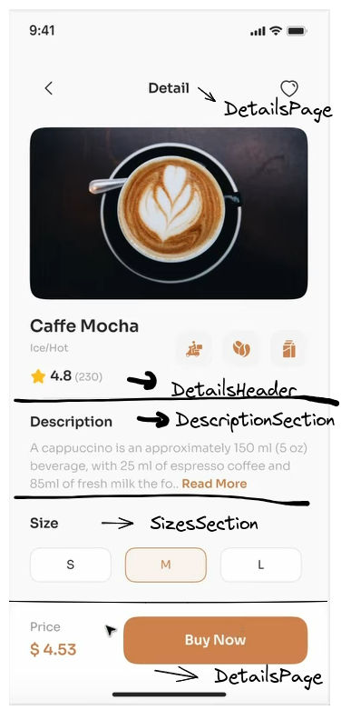
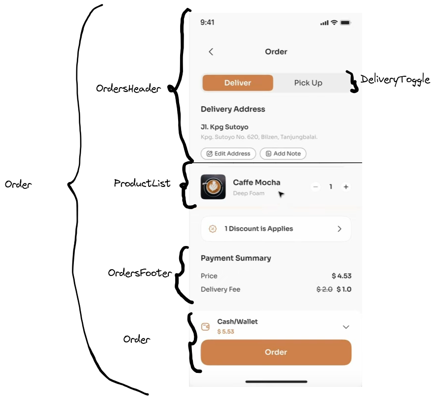
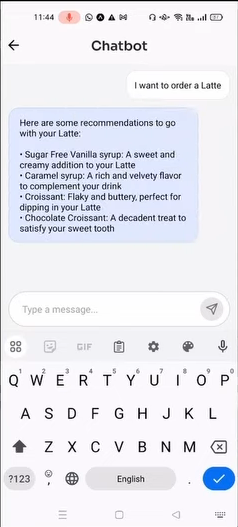

## Table of contents

## 1. Nội dung chi tiết:
### 1.1. Detail Page:
Tạo component cho phần Details của sản phẩm:

Một số yêu cầu:
- Phần thông tin phải scroll được
- Phần Price + Buy Now thì luôn overlap
Các components mới:
- DetailsPage
- DetailsHeader
- DescriptionSection
- SizesSection
### 1.2. Order Page
Tạo mục Order cho sản phẩm:

Các component mới:
- ProductList 
	- Đảm bảo số lượng không bị negative
- OrdersHeader
- DeliveryToggle
- OrdersFooter

Page mới:
- order
- thankyou (sau khi order success dẫn tới page này)

### 1.3. Chatbot Page
Page mới:
- chatRoom

Component mới:
- MessageList
	- Hiển thị tất cả tin nhắn
	- Phải scroll được
	- Styling tin nhắn của user và bot riêng biệt
 - TypingIndicator
	 - Tạo animation cho trạng thái "Bot is typing"

Logic xử lí message:
- Gọi tới API, và timeout đợi bot response
- Tạo file config để thêm RUNPOD_API_URL và RUNPOD_API_KEY
- Sử dụng Axios để xử lý Request và gọi tới API -> tạo function callChatbotAPI()
- Response được trả về dưới dạng **json** -> loop các object và thêm vào giỏ hàng

