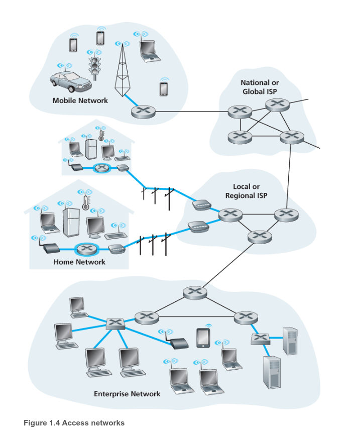

# Approach / Cách tiếp cận

1. Các cuộc thi mang ý nghĩa gì?
	>Để tôi có obstacle và dùng những thứ tôi đã tìm hiểu. Với tâm thế là xem những thứ tôi hiểu có thể làm được gì. 
2. Pái pai áp lực điểm số. Tôi abandon nó rồi
3. Để Self 2 thực hiện các việc học. Không ép buộc cái gì cả. Self 1 chỉ việc focus. Đọc chữ nè, coi ví dụ minh họa nè. Xong rồi documentate lại những thứ Self 2 đã học.
4. Những thứ documentate phải qua việc observation ở bản thân mình
# Questions
- [ ] Mọi người dùng Internet, mạng để ám chỉ điều gì?
- [ ] Người ta cấu trúc Mạng như thế nào? Mà ở end user như tôi chỉ biết là mạng đã kết nối  và thông tin được chuyển đến
# 1. Internet là gì
1. Là hạ tầng mạng cung cấp các dịch vụ mạng cho người dùng. Những ứng dụng mạng được chạy ở end user. Cho phép end user này kết nối đến end user khác. Giống như việc viết thư vậy. Internet ở đây giống như bưu điện: sẽ có các rule(*socket interface*) để người gửi follow và sẽ lo hết phần vận chuyển

### 1.1. Giao thức 
- Định nghĩa các phương thức và thứ tự các tín hiệu giữa 2 hoặc nhiều hơn các thiết bị giao tiếp cũng như sẽ có những hoạt động gì xảy ra khi mà gửi hoặc nhận tín hiệu.   

- Giống như cách con người giao tiếp.   

### 1.2. Mạng biên   
- Là các Web Server, thiết bị điện tử. Bởi vì nó là **end system** nên nó ở biên của Internet. Cụ thể hơn, mạng biên có thể kể đến bao gồm: desktop computers, và server, và mobiles devices. 
- Mạng biện hay **end systems** còn gọi là **host** bởi vì nó là thiết bị chạy application. => **host = end system**
#### 1.2.1. Mạng truy cập 
- Là mạng kết nối vật lý với các cục router ở biên, từ **end system** này đến **end system** khác 

- Từ **router ở biên**, cho phép người dùng kết nối đến Internet hoặc là các mạng khác thông qua kết nối có dây hoặc là không dây.
#### 1.2.2. Đường truyền vật lý
- Các bit được lan truyền dưới dạng sóng điện từ qua các đường truyền. Từ máy gửi đến máy nhận
- Có 2 loại đường truyền: **đường truyền có hướng** và **đường truyền vô hướng** 
	- **đường truyền có hướng**: Tín hiệu truyền trong chất rắn ví dụ: cáp đồng, cáp sợi quang
	- **đường truyền vô hướng**: Tín hiệu truyền trong không gian ví dụ: mạng cục bộ không dây, sóng vô tuyến 
- Cáp xoắn cặp (Twisted-Pair Cobber Wire): Hai dây đồng cách điện
- Cáp đồng trục(Coaxial Cable): Hai dây đồng đồng tâm, hai chiều, băng thông lớn
- Cáp sợi quang: Hoạt động tốc độ cao, tỉ lệ lỗi thấp
- Các loại liên kết không dây: Wireless LAN, Diện rộng(3g, 4g), Bluetooth, Sóng mặt đất, Vệ tinh

### 1.3 Mạng lõi
