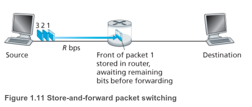
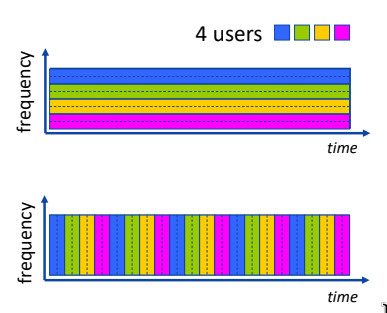
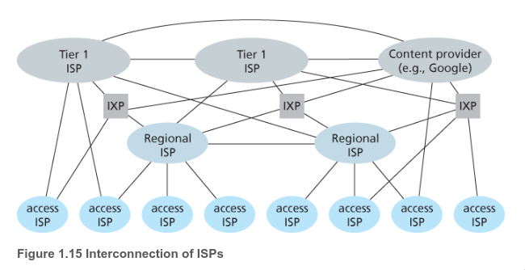

# Approach / Cách tiếp cận

1. Các cuộc thi mang ý nghĩa gì?
	>Để tôi có obstacle và dùng những thứ tôi đã tìm hiểu. Với tâm thế là xem những thứ tôi hiểu có thể làm được gì. 
2. Pái pai áp lực điểm số. Tôi abandon nó rồi
3. Để Self 2 thực hiện các việc học. Không ép buộc cái gì cả. Self 1 chỉ việc focus. Đọc chữ nè, coi ví dụ minh họa nè. Xong rồi documentate lại những thứ Self 2 đã học.
4. Những thứ documentate phải qua việc observation ở bản thân mình
# Questions
- [ ] Mọi người dùng Internet, mạng để ám chỉ điều gì?
- [ ] Người ta cấu trúc Mạng như thế nào? Mà ở end user như tôi chỉ biết là mạng đã kết nối  và thông tin được chuyển đến
# 1. Internet là gì
1. Là hạ tầng mạng cung cấp các dịch vụ mạng cho người dùng. Những ứng dụng mạng được chạy ở end user. Cho phép end user này kết nối đến end user khác. Giống như việc viết thư vậy. Internet ở đây giống như bưu điện: sẽ có các rule(*socket interface*) để người gửi follow và sẽ lo hết phần vận chuyển

### 1.1. Giao thức 
- Định nghĩa các phương thức và thứ tự các tín hiệu giữa 2 hoặc nhiều hơn các thiết bị giao tiếp cũng như sẽ có những hoạt động gì xảy ra khi mà gửi hoặc nhận tín hiệu.   

- Giống như cách con người giao tiếp.   

### 1.2. Mạng biên   
- Là các Web Server, thiết bị điện tử. Bởi vì nó là **end system** nên nó ở biên của Internet. Cụ thể hơn, mạng biên có thể kể đến bao gồm: desktop computers, và server, và mobiles devices. 
- Mạng biện hay **end systems** còn gọi là **host** bởi vì nó là thiết bị chạy application. => **host = end system**
#### 1.2.1. Mạng truy cập 
- Là mạng kết nối vật lý với các cục router ở biên, từ **end system** này đến **end system** khác 

- Từ **router ở biên**, cho phép người dùng kết nối đến Internet hoặc là các mạng khác thông qua kết nối có dây hoặc là không dây.
#### 1.2.2. Đường truyền vật lý
- Các bit được lan truyền dưới dạng sóng điện từ qua các đường truyền. Từ máy gửi đến máy nhận
- Có 2 loại đường truyền: **đường truyền có hướng** và **đường truyền vô hướng** 
	- **đường truyền có hướng**: Tín hiệu truyền trong chất rắn ví dụ: cáp đồng, cáp sợi quang
	- **đường truyền vô hướng**: Tín hiệu truyền trong không gian ví dụ: mạng cục bộ không dây, sóng vô tuyến 
- Cáp xoắn cặp (Twisted-Pair Cobber Wire): Hai dây đồng cách điện
- Cáp đồng trục(Coaxial Cable): Hai dây đồng đồng tâm, hai chiều, băng thông lớn
- Cáp sợi quang: Hoạt động tốc độ cao, tỉ lệ lỗi thấp
- Các loại liên kết không dây: Wireless LAN, Diện rộng(3g, 4g), Bluetooth, Sóng mặt đất, Vệ tinh

### 1.3. Mạng lõi - "Backbone"
- Là một phần quan trọng của mạng lưới máy tính mà kết nối các mạng lại với nhau. Cung cấp con đường để trao đổi thông tin. 

#### 1.3.1. Chuyển mạch gói / Packet switching
- Các thông tin mà **end user** muốn gửi tới nhau được cắt thành những chunk nhỏ hơn gọi là **packet**. **Chuyển mạch gói** sẽ vận chuyển các packet qua các liên kết từ nguồn đến đích.
- Chuyển mạch gói gửi **L** bits với tốc độ truyền **R** bits/s => Thời gian để truyền **L/R** s
- Hai chức năng chính: **Định tuyến** và **Chuyển tiếp**
	- **Định tuyến**: Hoạt động "toàn cục". Xác định tuyến đường từ nguồn đến đích cho các gói tin. Yêu cầu giải thuật định tuyến
	- **Chuyển tiếp**: Hoạt động "cục bộ". Chuyển tiếp từ đầu vào đến liên kết đầu ra thích hợp trên bộ định tuyến.
	- **Chuyển tiếp** như là công việc giúp mình từ lúc xuống ga tàu và chọn tàu tiếp theo để đi. Còn **định tuyến** thì cho biết những ga nào mình phải đi qua để tới điểm yêu cầu.
- **Lưu và chuyển** 
	- **Lưu**: Packet phải được chuyển tới toàn bộ, nếu chưa đủ bits thì các bits trước sẽ đợi hoặc lưu vào buffer 
	- **Chuyển**: Khi đã đủ các bits, packet mới bắt đầu được vận chuyển
 

- **Hàng đợi** và **Mất gói**: Hàng đợi là một tính năng khi mà lưu lượng package ở trong liên kết quá nhiều, các packet sau sẽ được đưa vào **output buffer** và đợi để vận chuyển. Tuy nhiên khi bị qua nghẽn, bắt buộc phải drop các package gọi là **mất gói**

#### 1.3.2. Chuyển mạch kênh / Circuit Switching
- **Chuyển mạch kênh** cần khi mà có sự yêu cầu về đảm bảo tốc độ giữa bên gửi và bên nhận như khi gọi điện thoại truyền thống
- **Chuyển mạch kênh**: Sẽ tạo một kết nối, đường truyền giữa người gửi và người nhận. Đảm bảo kết nối đó là của họ đến khi quá trình kết thúc. Tài nguyên dành riêng ≠ **chuyển mạch gói** do đó hiệu suất ổn định. Tuy nhiên xét về hiệu quả hơn thì **chuyển mạch  gói** giành chiến thắng ngày nay.
- Có 2 kiểu phổ biến trong **chuyển mạch kênh** là: 
	- **Ghép kênh tần số**: Được chia thành các dải tần số, và cuộc gọi sẽ được chỉ định vào một dải tần số nhất định và có thể truyền ở tốc độ tối đa của dải đó.
	- **Ghép kênh thời gian**: Thời gian được chia thành các khe. Cuộc gọi được chia vào các khe định kì, có thể truyền tốc độ tối đa. 

#### 1.3.3. Mạng của các mạng
- Phải hiểu khái niệm **ISP**, tức là trung tâm cung cấp mạng cho các dịch vụ của trung tâm đó. Tuy nhiên, càng có nhiều end user từ khắp các quốc gia muốn sử dụng dịch vụ, và càng có nhiều trung tâm cung cấp dịch vụ => các **ISP** có thể kết nối với nhau.
- **Mạng của các mạng** phụ thuộc vào nền **kinh tế và chính sách quốc gia** chứ không hoàn toàn dựa vào hiệu năng. 

### 1.4. Chậm trễ, mất gói, thông lượng
#### 1.4.1. Chậm trễ
- **Trễ xử lý tại nút**: Tổng thời gian của xử lý các header và xác định đích đến, xử lý bit lỗi
- **Trễ hàng đợi**: Tổng thời gian của packet đợi được chuyển ra kết nối, phụ thuộc vào có bao nhiêu package đợi
- **Trễ truyền**: Tổng thời gian tất cả các bits của package vào được hàng đợi -> Tổng số bit/ tốc độ xử lý bit -> L/R
- **Trễ lan truyền**: Tổng thời gian package di chuyển đến đích. -> Quãng đường / vận tốc di chuyển cả package

=> Total bằng tổng các loại trễ
- Chương trình **traceroute**
#### 1.4.2. Mất gói
- **Hàng đợi** có kích thước giới hạn. Đầy thì sẽ mất gói. Gói bị mất có thể được trả lại hoặc không.
#### 1.4.3. Thông lượng
- Định nghĩa là tốc độ (bits/s) mà client nhận được file được truyền từ server: **Tức thời** và **Trung bình** như trong cơ học
- Tưởng tượng **thông lượng** giống như hiện tượng **bottleneck**. Tức là như nước di chuyển trong ống. R bé hơn thì tốc độ là R đó.
- 
