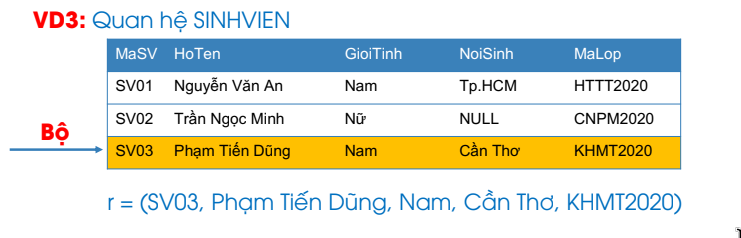
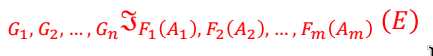
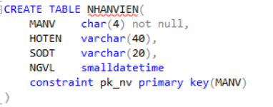

# Approach 
1. Đối với việc documentate, để Self 2 tự ghi chép lại cách nó làm, hoặc đại khái ý nó làm. Chứ Self 1 để im
2. 
## 1.1. Mô hình thực thể mối kết hợp

### 1.1.1. Thực thể và loại thực thể
- **Thực thể** là các entity, trong đời sống thì nó là các **object** cụ thể. Ví dụ: mặt hàng ChatGPT Plus, mặt hàng Adobe Creative Cloud. 
- Có gì để group các thực thể lại không? Có, đó là **loại thực thể**. Ví dụ: các mặt hàng trên được gom lại thành sản phẩm điện tử. 
### 1.1.2. Mối kết hợp 
- Vậy thì trong một dữ kiện có liên quan giữa các **loại thực thể** thì được liên kết bằng gì? **mối kết hợp**
	- SANPHAM và NGUOIMUA liên kết với nhau bằng mối kết hợp lựa chọn
	- Tóm lại **mối kết hợp** là **quan hệ** giữa **2 loại hoặc chính nó**
		- **Chính nó** chính là **mối kết hợp đệ quy**
	- **Giữa 2 loại** có thể có nhiều hơn 1 mối kết hợp
### 1.1.3. Bản số
- Ám chỉ (số lượng tối thiểu, số lượng tối đa), gồm 4 loại:
	- (0,1): không hoặc 1
	- (1,1): duy nhất 1
	- (0,n): không hoặc nhiều 
	- (1,n): 1 hoặc nhiều

## 1.2. Mô hình Dữ liệu Quan Hệ
![example_table.png][../../assets/images/example_table.png]
### 1.2.1. Thuộc tính
- Là những thông số của quan hệ, tưởng tưởng nó là các cột: (MaSV, HoTen, GioiTinh, NoiSinh, MaLop) 
- Kí hiệu miền giá trị: Dom(GioiTinh) = ('Nam', 'Nữ')
### 1.2.2. Quan hệ
- Kí hiệu: R=(A1, A2, ..., Ai)
- R+ là tập thuộc tính: (A1, A2, ..., Ai)
### 1.2.3. Bộ giá trị
- Kí hiệu  r nhỏ 

## 1.3. Đại số quan hệ
### 1.3.1. Phép hội - Phép giao - Phép trừ
- Phải cùng **miền giá trị**
### 1.3.2. Tưởng tượng miền giá trị
### 1.3.4. Một vài yếu tố khi xây dựng 
- **Yếu tố lặp lại**: Nếu quan hệ không có lặp lại giá trị của thuộc tính khóa chính => Không cần lược bỏ. Còn ko thì lược bỏ bằng các phép toán. AVG, Min, Max, Sum, Count 

- **Tất cả**: Phép chia??
- Vẽ bảng ra cho dễ hình dung, xem lúc nào cần left-outer hay right-outer hay full-outer
## 1.4. SQL
### 1.4.1. Tương tác với bảng
- Cú pháp: CREATE 

- Sửa bảng: **ALTER** 'TABLE'
	- Khi: 
		- thêm thuộc tính (LOAI):  ADD 'tên' 'kiểu dữ liệu'
		- sửa kiểu dữ liệu thuộc tính (char -> varchar): ALTER COLUMN 'ten' 'kieu du lieu'
		- xóa thuộc tính: DROP COLUMN 'ten'
		- thêm ràng buộc: ADD CONSTRAINT. Ví dụ: ADD CONSTRAINT Check_Dv CHECK (DONVI IN ('quyen', 'cai'))
		- xóa ràng buộc: DROP CONSTRAINT Check_Dv
- Xóa bảng: DROP TABLE 
### 1.4.2. Thêm dữ liệu vào
- Cú pháp: **INSERT** và cần gì? table nào, cột nào? 

- Sửa dữ liệu: **UPDATE** 

- Xóa dữ liệu: **DELETE** 

- Thêm dữ liệu vào như thế nào, cập nhật dữ liệu ra sao, xóa dữ liệu sao
- Các logic như thế nào?