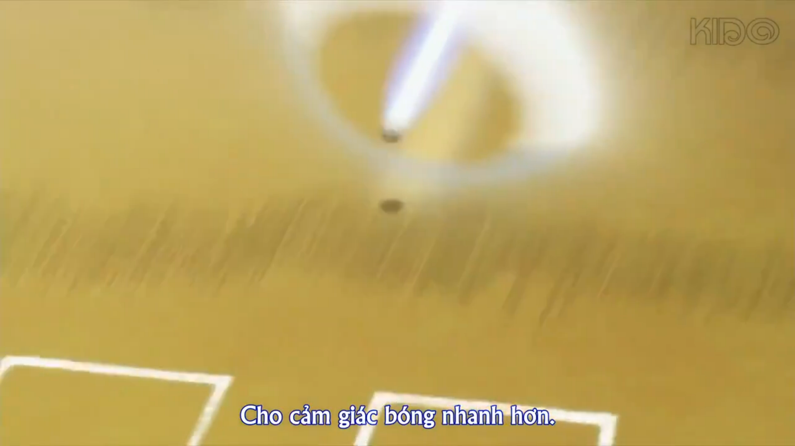

## Table of contents
##  1. Sawamura
### 1.1. Kỹ năng 
<<<<<<< HEAD

=======

Khi nói về kỹ năng của Sawamura, bóng nhanh hình thành được **trạng thái** đó một phần vì cảm giác của Sawamura đạt đến **ngưỡng** để các đầu ngón tay trở nên linh hoạt hơn. 

**Xuất phát** từ cảm giác phần **thân trên**. Rồi đến cảm giác **tay phải** cầm găng. Rồi đến **phần hông trên**. Rồi đến **đầu ngón tay**. 

Chính **cậu ấy** là người cho phép **bản thân** thời gian để **cải thiện** từng phần. 
>>>>>>> d1ba48f (update post)
