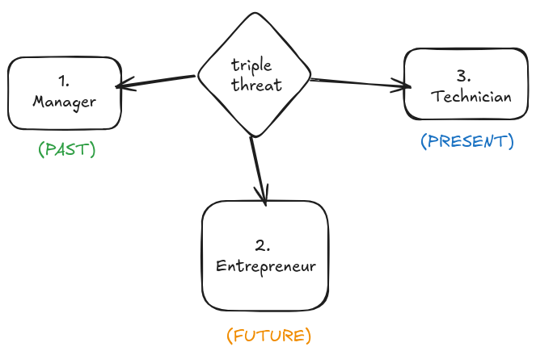
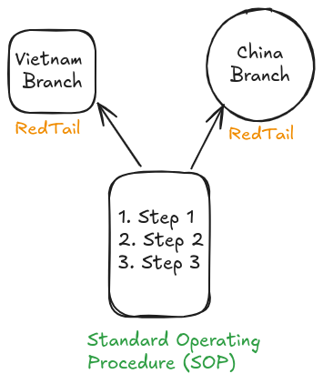

## Table of contents
## 1. Past, Present, Future
### 1.1. Models sẵn có

Trong cách suy nghĩ của tôi luôn có **3 models** như trên.
- **Technician**: Thực hành các bài tập dẫn bằng chân trái
- **Entrepreneur**: Suy nghĩ về việc trở thành cầu thủ thuận thêm chân trái nữa là thuận 2 chân
- **Manager**: Thực hiện phân tích từ **thuận**, chia thành các **components** nhỏ hơn cũng như các bài tập để thực hành. 

Ví dụ như trên để cho tôi thấy **rõ hơn** về xu hướng suy nghĩ của 3 models. Đại khái Entrepreneur sẽ là hướng tới **những sự quan tâm mới**; Manager sẽ **vạch ra những chuỗi hoạt động**; Techinician sẽ **thực hiện** các **công việc** đó
### 1.2. Self  1 
Tuy nhiên, cũng cần phải tránh **nhầm lẫn** với những suy nghĩ của Self 1:
- Techinican: Không phải **thực hiện** răm rắp theo những **hướng dẫn** đã định sẵn mà nhìn nó dưới một **mô hình ngoại** và dành không gian cho **Self 2**
- Entrepreneur: Không phải những **sự quan tâm mới** mà được xuất phát từ sự **đánh giá** tốt xấu của Self 1
- Manager: Không phải **bê nguyên** những chỉ dẫn từ mô hình bên ngoài và để **Self 1** ra lệnh. Phải dựa trên **dữ liệu** và không thêm yếu tố **đánh giá**
### 2. Quy trình
Quy trình là một **chuỗi các hành động**. Về tại sao **quy trình** vốn tồn tại xưa nay và chưa bao giờ **biến mất**. Lí do thứ nhất là quy trình được coi là một **mô hình ngoại**, và yếu tố quan trọng là **cách tiếp cận** với mô hình đó. Lí do thứ hai là quy trình giúp người thực hiện **hình dung** được, từ đó giúp Self 2 cảm giác tốt hơn. 

Khi mà đã **dễ** hình dung thì số lượng người có thể **tiếp cận** tăng.

Số người có thể tiếp cận tăng thì **ai cũng** có thể làm được cái quá trình đó. **Một** mô hình ngoại điển hình là trong y học, người ta luôn hướng đến một **quy trình** cung cấp thuốc cho bệnh nhân có **triệu chứng cụ thể**. Bởi nếu chỉ có bác sĩ giỏi có khả năng cung cấp thuốc thì **tính mạng** con người sẽ ra sao? 

Trên cương vị người đứng đầu, quan tâm tới **sản phẩm** là 1 phần nhỏ so với quan tâm tới **doanh nghiệp**. 