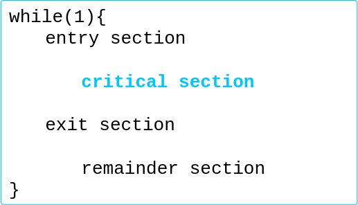
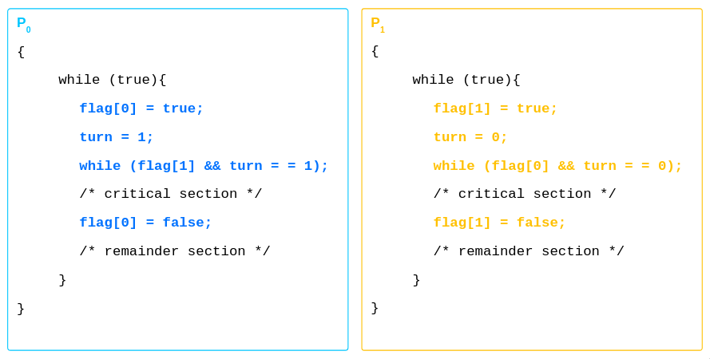

## Table of contents
## 1. Race condition
Trongbài toán **Producer & Consumer** biến **count** được **truy cập** bởi cả quá trình. Trong bài toán **Cấp PID**, nếu cả 2 process khác nhau đều **fork()** cùng 1 lúc thì **next_availiable_pid()** được **truy cập** bởi 2 processes.
-> cần một cơ chế để đảm bảo thự tứ trước sau -> **race condition**

## 2. Vùng tranh chấp - Critical Section
Là vùng của các tiến trình, mà tại đó thực hiện việc truy cập các dữ liệu được **chia sẻ chung** và tại **1 thời điểm** chỉ có **1** tiến trình được truy cập.

Qúa trình **truy cập** critical section của tiến trình: 
- Yêu cầu đến entry section -> vào critical section -> thoát ra bởi exit section -> thực thi phần còn lại remainder section


Giải pháp cho critical section phải đảm bảo **3 yêu cầu**:
- Mutual Exclusion: Chỉ **1 tiến trình** được thực thi vùng critial section của nó
- Progress: Tiến trình **tạm dừng** bên ngoài vùng tranh chấp không được **ngăn cản** tiến trình khác vào vùng tranh chấp
- Bounded Waiting: Tiến trình sau khi gửi **yêu cầu** vào critical section chỉ đợi **một khoảng thời gian** để tránh **starvation** (bởi waiting vô thời hạn)
### 2.1. Giải pháp Peterson
- Giải pháp dành cho **2** tiến trình
- 2 tiến trình chia sẻ **2 biến**:
```java
int turn;
boolean flag[2];
```
- Biến **turn** kiểm soát xem tiến trình nào **tới lượt** vào vùng tranh chấp 
- Mảng **flag** kiểm soát xem tiến trình đã **sẵn sàng** vào vùng tranh chấp

- Kiểm tra các yêu cầu:
	- Mutual Exclusion: P1 chỉ vào critical section khi **flag[0] = false** và **turn = 1**; turn không thể cùng bằng 1 và 0
	- Progress: P0 còn ở **remainder section** thì cũng không ngăn cản P1 vào **critical section**
	- Bounded Waiting: Sau khi **kết thúc** remainder section, P0 không phải đợi **quá lâu** (1 lượt critical state P1) để vào critical state
### 2.2. Giải pháp Peterson và kiến trúc hiện đại
Ở các kiểu kiến trúc **hiện đại**, một vài tính chất không giúp ích giải pháp **Peterson**: 
- Để cải thiện **hiệu suất**, vi xử lý hoặc trình biên dịch sẽ **sắp xếp** lại các **thao tác** mà **độc lập** với nhau
- 