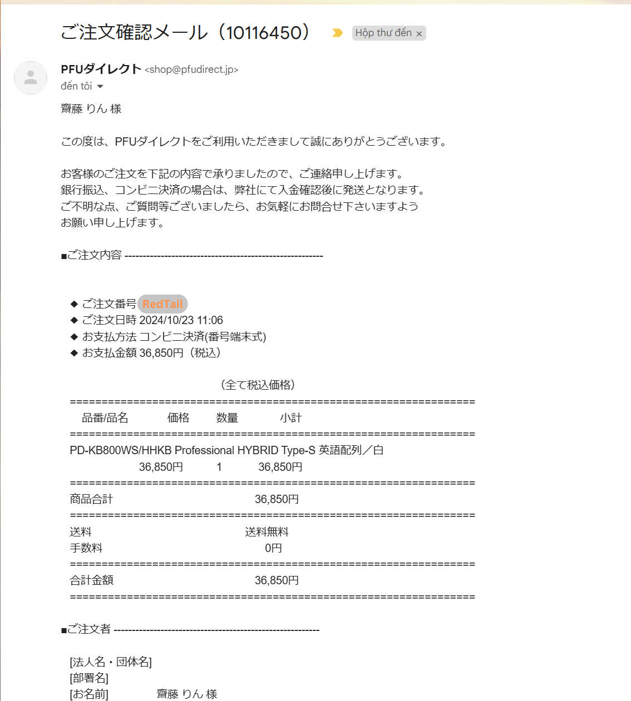
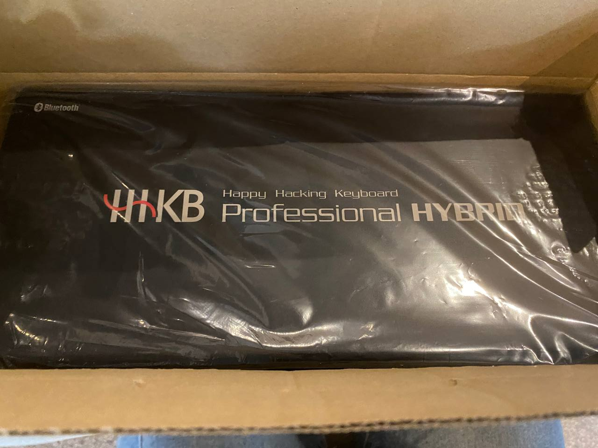
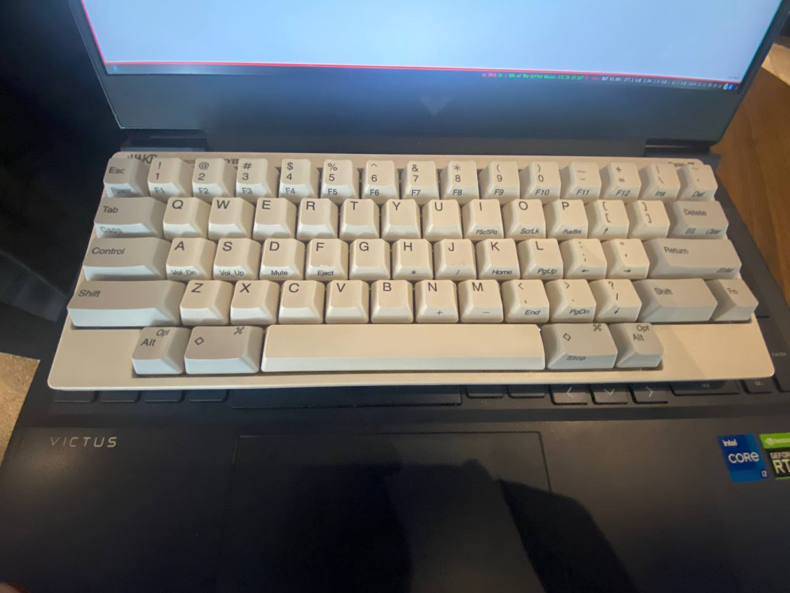
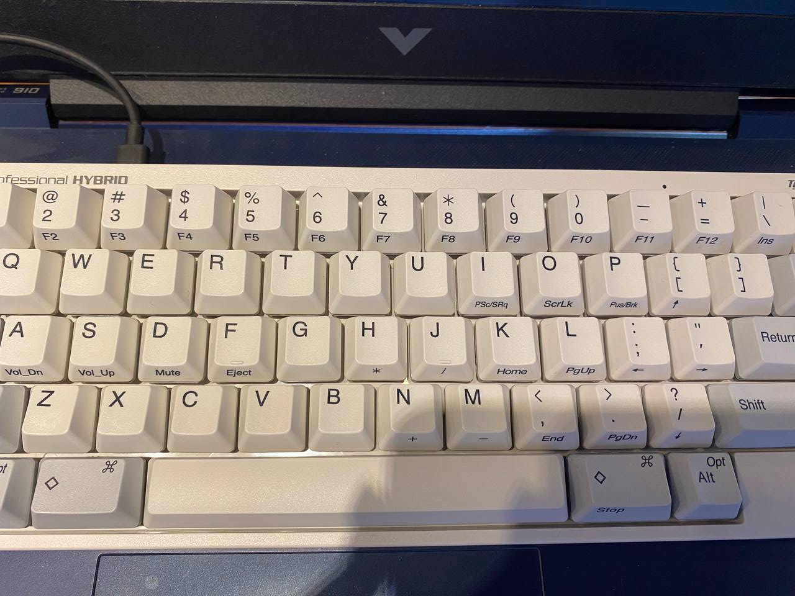

## Table of contents
## 1.1. Mua như thế nào
Giá hiện tại của em HHKB Professional Hybrid Type-S: 
- [hhkeyboard.us](https://hhkeyboard.us/hhkb/pro-hybrid-type-s/sku/cg01000-297001) là 229$ tức 7,593,110 VND chưa tính phí ship 
- [pfu.ricoh.com](https://www.pfu.ricoh.com/direct/hhkb/detail_pd-kb800ws.html) 6,148,364 VND tức 36,850 Yen 

Tôi nhờ dịch vụ order bên Nhật về khoảng 6,500,000 VND  

## 1.2. Hàng về
Một số hình ảnh:

Tính chính xác thì mất tổng cộng gần 3 tuần để từ bên Nhật về tới Hồ Chí Minh

## 2.1. Cảm nhận
Về cảm giác ấn, nó rất khác so với kiểu bàn phím cơ. Không cảm giác **cạch cạch** mà rất mềm mượt. **Vô cùng thích hợp** để gõ văn bản, coding.