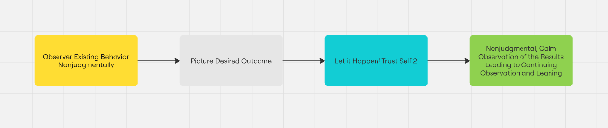
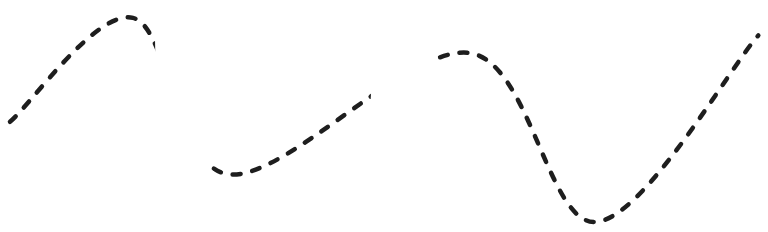

## Table of contents
## 1. Cốt lõi
Bản chất của **con người** là muốn được **hiểu** về sự vật, sự việc mà tôi **chưa được** nhìn thấy nhiều trên một **phương diện** nào đó.

Nó **phụ thuộc** vào chọn **học cái gì** và **tốc độ học**.
## 1.1. Học cái gì?
Chọn cái chúng ta tốt sẽ giúp duy trì sự enjoyment. Chọn chủ đề học **không gây ngán**, tức là nó không bị static. Ngoài ra, chủ đề học cũng **không nên thay đổi quá nhiều**. 

Như thế nào là chủ đề học **quá ngán**. 
- Nhân viên bán hàng quán cafe: 
	- Thứ cần phải học mỗi ngày: Học cách đến đúng giờ, học cách hỏi khách uống gì, học cách thu tiền, học cách dọn bàn
	- Những cuộc thi: Khiến khách hứng thú với món đắt tiền (đồng nghĩa với ngon!!) \
=>  Những thứ **học được** đều có thể học trên **1 ngày** lý thuyết -> quá tĩnh
- Chạy xe máy, xe hơi công nghệ:
	- Thứ cần phải học mỗi ngày: học kĩ năng lái xe, giao tiếp với khách (chủ yếu là first and last impression)
	- Những cuộc thi: Chở được bao nhiêu khách mỗi ngày \
=> Những thứ **học được** nhanh trở nên quá tĩnh sau **một khoảng** thời gian

Như thế nào là chủ đề học **không quá ngán**
- Tận hưởng cảm xúc con người:
	- Thứ cần phải học mỗi ngày: Tại sao con người đó lại có hành động như vậy, tại sao họ nói một kiểu làm một kiểu, tại sao họ lại chỉnh chu như vậy
	- Những cuộc thi: Cuộc thi chạm vào chiều sâu của họ, cuộc thi nhấn chìm họ, cuộc thi nâng họ lên \
=> Cảm xúc con người **không bao giờ là một đường thẳng** 

Quy luật **tế bào chết** khi tôi học về cảm xúc con người:
- Tôi có một khối tế bào để **quan sát tốt**, không cần phải thiết lập tế bào quan sát mới

Sự enjoyment khi học:
- Tôi có thể giúp họ **đắm chìm** trong khối cảm xúc đó
## 1.2. Tốc độ học
Khi nói về học, tưởng tượng là **1 cái khung**. Khi mình học được kiến thức **mới**, cái khung đó sẽ bị **vứt bỏ**, giống với cái cách tế bào chết đi hình thức tế bào mới. **Cho nên**, sẽ gây stressed nếu như tốc độ thay đổi **tế bào** quá **nhanh**.
## 2. Law of endorphins
- Sự liên quan tới **hoạt động thể chất** sẽ giúp release endorphins
- Nhiệt độ **càng ấm** sẽ tăng chỗ chứa endorphins
## 3. Đọc truyện Shounen, coi giải Esport 
### 3.1. Bản chất
Hãy nhớ lại những **nhu cầu** của cơ bản của **Self 2**. Nó mong muốn được học, được hiểu, công nhận cái hay cái đẹp. 

Khi đọc truyện **Shounen**, các yếu tố tôi **tập trung** vào:
- Sự đa dạng, nguồn gốc của các nhân vật. Như trong **Naruto** thì sự đa dạng ấy nằm ở mỗi nhân vật đều ở mỗi **tộc khác nhau** và **một làng khác nhau**. Mỗi tộc thì lại có những **thuật** chỉ có tộc đó mới thi triển được.
- Nhân vật **phản diện** thú vị, mà đời thường **tỉ lệ** gặp thấp. Nhân vật đó không chỉ là **chướng ngại vật** với anh hùng mà còn có những **động lực** tốt khiến cho người đọc **ủng hộ**. 
- Sự **tương tác** giữa các nhân vật trong một chuyến phiêu lưu, một sự kiện, một cuộc tổng tấn công liên kết, và khơi bày được nhiều sự thật

Khi coi giải **Esport**, các yếu tố tôi **tập trung** vào:
- **Quốc gia** của mỗi đội tuyển, các **thành viên** của đội tuyển, **lịch sử** của đội tuyển. -> Để biết mình **cổ vũ** cho đội tuyển nào.
- Các **giải đấu** mà đội tuyển ấy tham dự -> Liệu **đội tuyển** ấy có tiến xa được hay không

Cảm giác của Self 2:
- Không thể **biết gì**, hay **dự đoán** gì. Chỉ có sự mong ước sẽ có **cái kết đẹp**
### 3.2. Học sao để Self 2 cảm giác cái đẹp
Tôi không cần phải học cái gì **cần thiết**, **Self 2** sẽ tự biết lấy những **kiến thức** cần thiết đã được tích lũy chứ không phải **Self 1** ra lệnh **cần phải học** những gì

Giống như Esport, Shounen, hãy kiếm cho **Self 2** một **nhân vật** mà nó **thích** để mà có thể cổ vũ. 
### 3.3. Tương tác như thế nào với những dự án trên trường
Điều cần nhớ là mình **không phụ thuộc** vào bất cứ dự án nào, kể cả **kết quả**. Xét cho cùng hãy để **chúa** quan tâm tới những thứ ấy. Thứ **phù hợp** với mình là hãy **cảm giác** nhiều hơn về dự án đó để cho Self 2 có thể tìm thấy **nhân vật** mà nó yêu thích và để cho **Self 2** có thể thấy **cái đẹp**. 

Vậy các **cuộc thi** giữ **vai trò** gì? Ý nghĩa là giúp cho Self 2 **khám phá** những khả năng của nó, **phù hợp** với **nhu cầu** muốn được **học**, về khả năng mà bản thân không ngờ tới.

Đúng vậy, **ở các cuộc thi** tôi xem xét những **kĩ năng** nào của bản thân được hội hợp lại.

Với mục đích **luyện sự tập trung**, bởi nhờ sự tập trung đấy **Self 2** mới được giành **toàn bộ** không gian để trải nghiệm.
### 4. SOP nhưng không phải SOP?
### 4.1. SOP và Self 2
Liệu 1 quy trình cụ thể và rõ ràng có ảnh hưởng tới Self 2

Nên **nhớ rằng** để tối ưu Self 2 là phải để nhiều **không gian** cho Self 2 cảm nhận. Tiếp cận những hướng dẫn, những kiến thức giống như là external model. 

SOP tức là quy trình, tức là tạo những **mối liên kết** giữa các hoạt động với nhau. Hãy nhớ lại 4 bước để thay đổi thói quen cũng có quy trình nhưng tại sao lại **không** ảnh hưởng đến Self 2. \
=> Từ đây lại phải nói tới **sự liên kết** trên **loại** hoạt động nào?

Nhắc mới nhớ tới khái niệm về **black box**. Điểm chính là **input** và **output**. Nếu như Self 2 có **tính chất** đó giống black box. Thì 4 bước để thay đổi thói quen chính là giúp input output có thể hoạt động một cách tự nhiên.

Vậy SOP **có thể** kết hợp cùng với Self 2. Tức ta có thể **tune** mô hình SOP để giúp cho Self 2 có được **nhiều không gian** nhất. 
### 4.2. Khởi tạo SOP

Đây chính là hình ảnh **của những mô hình ngoại**: 

Giành **thời gian** và **không gian** cho **Self 2** là cách **duy nhất** để nối nó lại

Bây giờ, chúng ta sẽ làm 1 cái **SOP** cho quá trình học:
- "Fall in love" stage
	- List toàn bộ kiến thức liên quan tới **khái niệm** mình tìm hiểu. Kể cả những thứ đối lập
- "Erase" stage:
	- **Xóa** những liên kết giữa các khái niệm và để Self 2 trải nghiệm và **tự nối** lại.
	- Giả sử khái niệm được **viết trên giấy** thì xóa tức là **xóa chữ**

