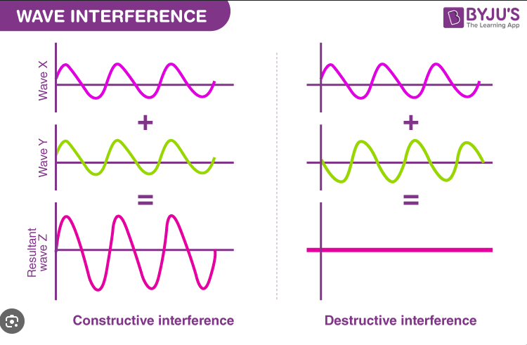

## Table of contents
## 1. Khái niệm
Khái niệm là những **ý tưởng** trừu tượng để hình dung **sự vật** hoặc một **khái niệm** khác được hình thành bởi **con người**.

-> Câu hỏi: Liệu mọi người có nhìn thấy những thứ **trước mắt** giống mình? Hay **chỉ có** mình là thấy được những cảnh đẹp này?

Những **khái niệm** và **interference** của những khái niệm ấy đều được hình thành bởi **Self 2**.

Giống ấy chứ ha. Wave X là khái niệm X, Wave Y là khái niệm Y. **Chúa** làm cho Wave X **va vào** Wave Y và ra một Wave mới. **Self 2** giống như Chúa vậy. 

**Để ý** thì việc định nghĩa Wave X là như thế nào, Wave Y như thế nào cũng làm **thay đổi** nhiều ấy chứ.

## 1.1. Cuộc sống cùng lúc rất nhiều và rất ngắn
Hãy trải nghiệm **nhiều nhất** có thể vì thế giới có rất **nhiều thứ** để trải nghiệm. Nhưng cũng hãy trải nghiệm **nhiều nhất** có thể vì không còn **nhiều thời gian** để trải nghiệm.

Hãy **để Self 2 không gian** và tận hưởng nhé! 