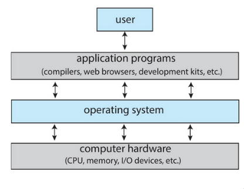
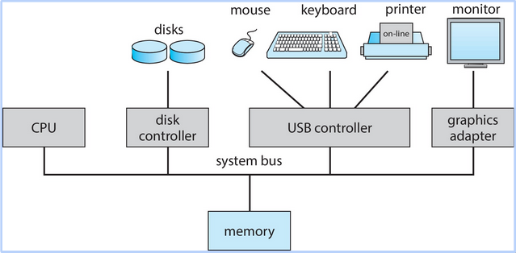
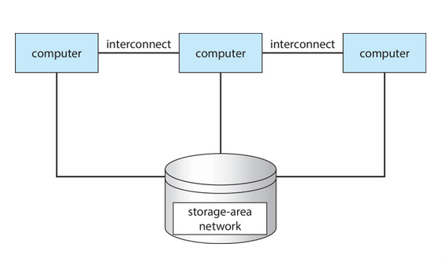
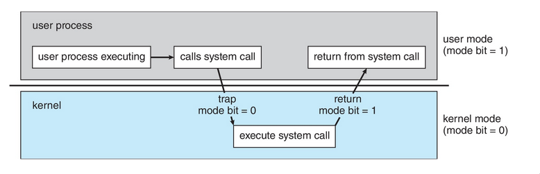
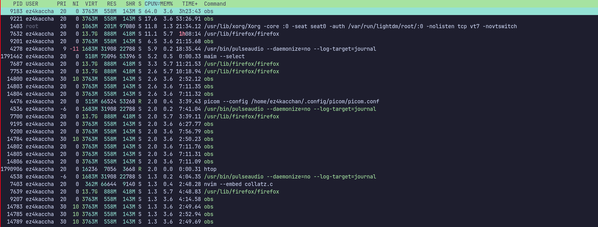
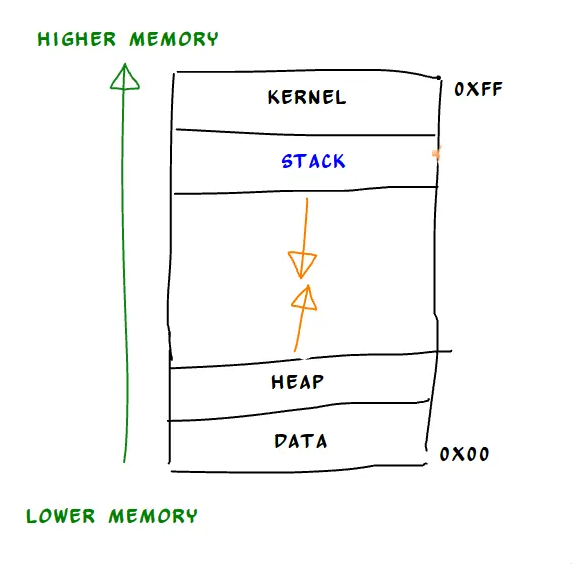
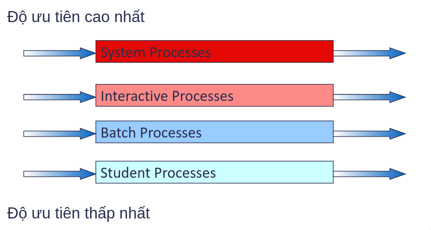

# Approach

## 1.1.  Khái niệm chung về Operating System
 Hệ điều hành là phần chịu trách nhiệm chạy ứng dụng, thậm chí là nhiều ứng dụng của một lúc, cho phép ứng dụng chia sẻ bộ nhớ, tượng tác với các thiết bị. 
 
 Tóm lại là phần **trung gian** giữa phần cứng và người dùng. **Điều khiển** phần cứng và **cung cấp** dịch vụ cho người dùng.
 
### 1.2. Cách hệ điều hành hoạt động
**Easy to use**: vì đó chỉ gồm 3 phần:
- Nhân(kernel): luôn hoạt động khi máy tính hoạt động
- Chương trình hệ thống: được đóng gói cùng với lại hệ thống nhưng không phải nhân
- Chương trình ứng dụng: tất cả các chương trình không có liên quan đến hệ thống

 
- Các thiết bị như mouse, keyboard được điều khiển như thế nào?
- Sytem bus hoạt động ra sao
#### 1.2.1. Đồng thời
- Có mốt vấn đề về hiệu điều hành đó là nó chạy từng câu lệnh. 
- Vậy thì làm sao để thiết bị I/O và CPU chạy đồng thời? Ngày nay thì đó là yêu cầu cần thiết
	- Đầu tiên, các thiết bị I/O được điều khiển bởi các **trình điều khiển thiết bị** (device drivers).
	- Khi có nhiều thiết bị I/O thì máy xử lý như thế nào, phải qua một cái bus để kết nối tới **memory** và cả **CPU**
	- Khi trình điều khiển thiết bị xử lý xong sẽ kết thúc thông qua thao tác **ngắt** (Interrupt)
##### 1.2.1.1. Trình điều khiển thiết bị 
- Có những numbers được hệ thống gán cho từng thiết bị như là những index trên hệ thống. Dựa vào những **index** đó mà hệ thống biết device drivers nào xử lý thiết bị nào.
- 70% dòng code của hệ điều hành liên quán tới trình điều khiển thiết bị.

##### 1.2.1.2. Ngắt 
- Ngắt là cơ chế khi mà các thiết bị muốn **thông báo** cho CPU rằng có data muốn truyền hay khi hoạt động đã hoàn thành.
- Hệ điều hành hoạt động theo hướng **ngắt**
- Ngắt làm cho CPU chuyển đến interrupt service routine thông qua interrupt vector (chứa địa chỉ).
- Quá trình xử lý phát sinh và xử lý ngắt phải bao gồm việc **lưu lại thông tin địa chỉ** 

#### 1.2.2. Cấu trúc lưu trữ
Khi nói về hệ thống lưu trữ, yếu tố performance và cost luôn được đề cập tới:
- **Performance**: Tốc độ
- **Cost**: Giá thành của sản phẩm lưu trữ, đặc biệt quan trọng khi cung cấp giải pháp cho người dùng.
- Ngoài ra, một yếu tố khiến cho HDD, SSD, USB khác với RAM là **volatility**. Tức khả năng lưu trữ khi không có nguồn điện.

Từ volatility ta mới chia ra làm 2 bộ phận:
- **Bộ nhớ chính**: Là nơi lưu trữ chính khi máy tính hoạt động, tức có **nguồn điện**. 
	- Được xây dựng dựa trên công nghệ bán dẫn DRAM
- **Bộ nhớ thứ cấp**: Mở rộng cho bộ nhớ chính để lưu trữ. Đặc biệt, khi **không có nguồn điện**.

-> Vậy quá trình mà các chương trình hoạt động diễn ra ntn?

Nhớ rằng máy tính hoạt động theo kiến trúc Von Neumann. 
- **Bộ xử lý trung tâm CPU <-> Bộ nhớ <-> Thiết bị I/O**
- Nạp lệnh từ bộ nhớ vào CPU là **real** nha mấy ní. Còn sao lại có lệnh trong bộ nhớ thì để mấy chương sau rồi nói ...
#### 1.2.3. Bộ xử lý 
Có 3 hệ thống xử lý:
- **Hệ thống đơn bộ xử lý**: Sử dụng **1 lõi** bởi bộ xử lý đa dụng. Tức là để xử lý tác vụ nặng sẽ tốn **rất nhiều tài nguyên** 
- **Hệ thống đa bộ xử lý**: Khác biệt ở chỗ **sử dụng chung 1 bộ nhớ chính** giảm lượng tài nguyên. Vì có nhiều bộ xử lý. 
	- **Nhanh hơn**: Có thể dùng nhiều bộ xử lý để chạy tác vụ.
	- **Tốn kém ít**: Đã nói ở trên
	- **Độ tin cậy cao**: Hay ở chỗ là nhiều bộ xử lý và dùng chung một bộ nhớ nên khi **1 thằng fail** thì **có thể nhờ thằng khác chạy giùm**
	- Khi có **nhiều bộ xử lý** thì sẽ đa dạng **cách kết hợp**. Nên có 2 loại:
		- Bất đối xứng: Tức là mỗi thằng chạy 1 tác vụ
		- Đối xứng: Nhiều thằng cùng chạy 1 tác vụ
- **Hệ thống gom cụm**

- Tức các computer được liên kết lại và dùng chung storage để được coi là **1 hệ thống duy nhất** . Ý tưởng chỉ vì muốn **tăng khả năng tính toán** những **giảm được cost**. 
	-  Cũng được chia ra như **đa xử lý** vì bản chất là **mỗi node như một bộ xử lý**
#### 1.2.4. Tiếp đến câu chuyện xử lý như thế nào?
Gồm 3 kiểu xử lý:
- Đơn chương: Okay, lệnh nạp vào RAM xong nạp vào CPU. Tuy nhiên chỉ được **1 lệnh tại 1 thời điểm**. Tức 1 cách **tuần tự**: xong thằng này rồi mới tới thằng kia. 
- Đa chương: Không muốn **1 lệnh** như vậy thì mới đa chương. **Nhiều công việc** được nạp vào. 
	- Có **bộ định thời công việc** chọn 1 công việc và chạy
	- Khi 1 công việc chuyển sang I/O tức là phải waiting thì sẽ switch sang công việc khác. Giống như khi đi vệ sinh vậy. Có người dùng phòng rồi thì mình phải đi làm task khác.
	-> Tăng **hiệu suất**
- Đa nhiệm: Mở rộng của đa chương. Cả 2 **đều chạy nhiều công việc trên bộ xử lý**. Đa chương sẽ ráng sử dụng hết CPU để hoàn thành công việc. Còn đa nhiệm sử dụng CPU để chạy tác vụ nhằm cải thiện thời gian phản hồi.
#### 1.2.5. Cách hệ điều hành chia hai mảng khác nhau
Như đã nói từ trước **hệ điều hành là trung gian** giữa user và hardware. Vậy thì cắt nửa nó ra, nửa trên để dành cho user hay còn gọi là **user mode** (chế độ người dùng). Nửa dưới dành cho hardware gọi là **kernel mode** (chế độ hạt nhân). 
- Có thể **mở rộng nhiều hơn 2 chế độ**. Nhưng quy ước chung là cứ như vậy đi.

#### 1.2.6. Tiến trình
Program thứ chúng ta luôn thấy trên desktop. Nó **nằm im** một chỗ quài, chỉ khi nào install hay uninstall thì mới có sự thay đổi. Vâng, nó là **tính chất** của program. **Nằm im ở trên storage**. 

Khi chúng ta program, thì các câu lệnh sẽ được nạp vào bộ nhớ và trở thành **tiển trình**. Tiến trình thì nó **động**, thử *htop* trên terminal là biết

Bao gồm:
- Text Section và Data Section dùng lệnh **readelf -x .text file**
- Program Counter, Processor Registers. Có thể kiểm tra bằng **gdb**
- Heap section và Stack section cũng có thể kiếm tra bằng **gdb** và có thể reverse engineering ofc.

Vậy thì làm sao khởi tạo tiến trình? Tóm quần lại là ảnh cần định danh duy nhất, không gian riêng tư và cuốn nhật ký (PCB)

##### 1.2.6.1. PCB 
Bao gồm:
- **Trạng thái tiến trình**: Nơi có bài toán về ready, running, waiting, terminated
- **Bộ đếm chương trình**: Đại khái là nó giữ câu lệnh tiếp theo. 
- **Các thanh ghi**
- **Thông tin lập thời biểu CPU**
- **Thông tin bộ nhớ**
- **Thông tin lượng CPU, thời gian sử dụng**
- **Thông tin I/O**

#### 1.2.7. Định thời CPU
Như đã nói ở **đa chương và đa nhiệm** là tận dụng tối đa CPU. Vậy thì thằng nào **giữ trách nhiệm** cho việc đó. 

Vừa hiệu suất CPU mà còn cải thiện thời gian phản hồi. 

Ảnh lo từ A-Z. Từ **tạo đến kết thúc tiến trình**. Kể cả chuyển qua tiến trình khác thông qua **context switch**

#### 1.2.7.1. Tạo tiến trình mới
Sử dụng hàm fork(), nó sẽ duplicate tiến trình hiện tai với danh nghĩa là tiến trình con. Vậy thì tiến trình mới có thể fork từ hệ điều hành hoặc từ tiến trình cha.

#### 1.2.7.2. Kết thúc tiến trình
Tự động kết thúc. Cuối chương trình gọi system call routine exit

Bị ép kết thúc bởi thằng tiến trình cha. Gọi system call routine abort với pid.

#### 1.2.7.3. Công tác tiến trình
Nãy đã có computer interconnect với nhau trên cùng một storage là dữ lắm rồi. Giờ còn có **tiến trình cộng tác với nhau** ngon ăn.
-> Perfomance-wise. Để giải quyết một bài toán lớn hơn. Tức mỗi tiến trình trở thành **1 submodule trong một phần mềm phức tạp**

Để thực hiện được thì phải có cơ chế giao tiếp và đồng bộ hoạt động ở hệ điều hành. **-> IPC** - Giao tiếp liên tiến trình
- **Bộ nhớ được chia sẻ**: Được quản lý bởi **tiến trình** chứ không phải hệ điều hành
- Giao tiếp với nhau. Gửi tin nhắn trực tiếp và gián tiếp cũng như có sự đồng bộ hóa trong gửi tin nhắn.
- **Queue** để chứa các tin nhắn.

#### 1.2.8. Tiểu trình
Nó **sử dụng CPU** và sử dụng một cách **cơ bản**.  -> Tiểu trình **nhanh hơn** tiến trình vì quá trình khởi tạo nhanh gọn hơn.

Hai loại: tiểu trình người dùng và tiểu trình hạt nhân.

# 2. More advanced into logic
## 2.1. Định thời
Phân biệt hai khái niệm **Tiến trình hướng CPU** và **Tiến trình hướng I/O**

Thằng nào chính, thằng nào ngoại. Ai ngốn nhiều thời gian trên CPU hơn.

Tốc độ tiến trình hướng CPU phụ thuộc vào **tốc độ CPU**. Còn tiến trình hướng I/O phụ thuộc vào yếu tố đợi quá trình I/O.

## 2.2. Các loại định thời
| **Loại lập lịch**         | **Mục tiêu chính**                                  | **Thời điểm thực hiện**                     | **Tần suất**               |
|---------------------------|-----------------------------------------------------|--------------------------------------------|----------------------------|
| **Long-term Scheduling**   | Quyết định tiến trình nào được nạp vào bộ nhớ chính | Khi cần nạp thêm tiến trình hoặc giải phóng | Không thường xuyên         |
| **Medium-term Scheduling** | Quản lý việc tạm ngừng và tiếp tục tiến trình       | Khi cần giải phóng hoặc tối ưu bộ nhớ       | Thường xuyên hơn long-term |
| **Short-term Scheduling**  | Chọn tiến trình để cấp phát CPU                    | Mỗi khi CPU rảnh hoặc có ngắt hệ thống     | Diễn ra liên tục           |
## 2.3. Các giải thuật định thời 
- **HRRN**: 
	- Chọn tiến trình có RR lớn nhất: (time spent waiting + expected service time)/expected service time
- **Multilevel Queue**: 
	- Hệ thống chia ra làm background task và high priority task. Từ đó sẽ có các giải thuật riêng. VD: background task dùng FCFS và high priority task dùng RR. Tùy thuộc vào độ ưu tiên này và. Tất nhiên phần trăm CPU cũng được assign khác nhau

- **Hạn chế lớn nhất** là không thể chuyển từ hàng đợi này sang hàng đợi khác lúc cần. **-> Multilevel Feedback Queue**
- Xét về yếu tố **CPU-burst** và theo cơ chế trưng dụng.
- Có **2 cơ chế** khi nói về **MLFB**: 
	- Các tiến trình hướng I/O sẽ được ở hàng đợi ưu tiên cao,  hướng CPU thì ngược lại
	- Cơ chế **Ageing**: đợi quá lâu ở hàng đợi ưu tiên thấp sẽ được chuyển lên cao
	- 
## 2.5. Định thời đa bộ xử lý
Có 2 cách tiếp cận là: **đa xử lý bất đối xứng** và **đa xử lý đối xứng** 
Ví dụ về các bộ:
- CPU có nhiều lõi vật lý (Multicore CPUs)
- CPU có nhiều luồng xử lý trên một lõi (Multithreaded cores) 
- Hệ thống NUMA (non-uniform memory access)
- Đa xử lý không đồng nhất (Heterogeneous multiprocessing) 
### 2.5.1. Đa xử lý bất đối xứng 
- Tất cả các thao tác lập lịch, xử lí I/O được thực hiện bởi **1 bộ xử lý** - hay còn gọi là master server.
- Còn **các bộ** còn lại thì xử lý user code.
-> **Đơn giản**, không cần chia sẻ dữ liệu giữa các bộ
-> **Tuy nhiên**, sẽ có hiện tượng nghẽn ở master server **(bottleneck)** gây giảm hiệu suất của hệ thống
### 2.5.2. Đa xử lý đối xứng
- Mỗi bộ xử lý **tự định thời** cho chính nó.
- Hai hướng xử lý tiểu trình cần định thời:
	- Các tiểu trình xếp trong cùng 1 hàng đợi trước khi chia ra cho từng bộ xử lý
	-> xảy ra hiện tượng tranh chấp tiến trình giữa các bộ xử lý -> **bottleneck**
	- Mỗi bộ xử lý tự tổ chức hàng đợi của riêng nó -> coi như là mỗi tiến trình, bộ xử lý có **1 không gian riêng**
### 2.5.3. Cân bằng tải (Load balancing)
**Mục đích**: Không thể để 1 core chạy hết các tác vụ mà phải phân đều ra

-> 2 cách:
- **Push Migration**: Có một tác vụ riêng để kiểm tra định kỳ lượng tải của các core. Nếu xảy ra quá tải ở đâu thì thực hiện đẩy qua các core ít tải
- **Pull Migration**: **Không đẩy** mà các core ít tải sẽ **kéo** các tác vụ từ các core bận.
### 2.5.4. Processor Affinity
Quá trình bộ nhớ đệm **(Cache)** lưu trữ các dữ liệu của tác vụ trên bộ xử lý hiện tại

-> Khi thực hiện cân bằng tải sẽ xảy ra 2 điều:
- **Repopulate**: Cache của bộ xử lý mới phải được nạp lại 
- **Invalidate**: Cache của bộ xử lý cũ phải được giải phóng

**=> Procces Affinity**: Tức là liên kết tác vụ vào các core cụ thể nhằm **cải thiện hiệu suất** bởi giảm thiểu **context switches** và **cache đã có sẵn trên core đó đỡ phải nạp lại hay giải phóng**

Có 2 dạng liên 5
