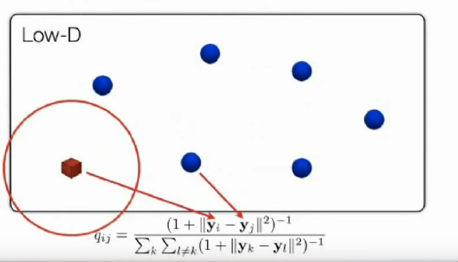

## Table of contents
## 1. Khái niệm liên quan
### 1.1. Dimensional Reduction
Là hình thức giảm chiều của dữ liệu xuống để có thể biểu diễn trong không gian số chiều nhỏ hơn với mục đích dễ xử lý hơn. Chính vì thế, các kĩ thuật phải đảm bảo giữ được thông tin quan trọng 

Các kĩ thuật giảm chiều được xếp vào 2 loại:
- Giảm chiều tuyến tính: dành cho dữ liệu có thể biểu diễn bằng các mối quan hệ tuyến tính. Một vài kĩ thuật như: PCA, 
- Giảm chiều phi tuyến tính: dành cho dữ liệu có cấu trúc phức tạp, đảm bảo các mối quan hệ phi tuyến tính của dữ liệu gốc. Một vài kĩ thuật như: t-SNE, Isomap
### 1.2. Stochastic Neighbor Embedding
Các phương pháp khác

| Noun                     | Action word |
| ------------------------ | ----------- |
| Other method             | associate   |
| high-dimensional points  | require     |
| Grid of point            | associated  |
| Low-dimensional Space    | only        |
| High-dimensional objects |             |
| Single location          |             |
| Low-dimensional Space    |             |
| Mapping                  | unfold      |
| ambiuos object           | separate    |
| disparate locations      |             |
Các phương pháp khác cố gắng tạo mối liên kết giữa các điểm trong không gian nhiều chiều thành "fixed grid of point" ở không gian có số chiều thấp. Tuy nhiên việc bắt mỗi object ở không gian nhiều chiều thành một điểm ở không gian thấp hơn gây khó khăn. Bởi thực tế một object mơ hồ thuộc về nhiều điểm khác loại hơn. 

Do đó ta có phương pháp stochastic neighbor embedding

| Noun                  | Action word |
| --------------------- | ----------- |
| SNE                   | place       |
| Object                | so as to    |
| Low-dimension space   | optimally   |
| neighborhood identity | preserve    |
| low-d image           | extended    |
| object                | each        |
|                       | multiple    |
|                       | different   |
|                       | of          |

## 2. Khái niệm chính
### 2.1. t-SNE

| Noun               | Action verb |
| ------------------ | ----------- |
| map                | build       |
| distance           | between     |
| points             | reflect     |
| similarities       | minimize    |
| data               | measure     |
| objective function |             |
| discrepancy        |             |
| similarities       |             |
|                    |             |
map: hàm mapping
xây dựng hàm mapping mà khoảng cách giữa các điểm phản ảnh sự tương đồng ở trong tệp dữ liệu. Cũng cần phải giảm thiểu số lượng hàm objective mà dùng để tính toán sự không thống nhất giữa sự tương đồng trong tệp dữ liệu và sự tương đồng trong hàm mapping

| Noun             | Action verb |
| ---------------- | ----------- |
| Pairwise         | Measure     |
| Similarities     | Between     |
| high-dimensional |             |
| objects          |             |

Khác với các phương pháp khác như PCA,

Xét trường hợp cặp điểm như trên mặc dù Euclidean Distance nhỏ nhưng lại không có điểm tương đồng. Phương pháp PCA mục đích duy trì general structure của dữ liệu qua việc giữ lại những cặp có khoảng cách lớn

Vậy làm sao để duy trì những cặp có khoảng cách nhỏ?

#### 2.1.1. High-D
Phương pháp t-SNE hướng tới việc giữ lại những cặp gần nhau trong local structure.

Cụ thể hơn, ở không gian nhiều chiều:

Xét điểm đỏ là $x_i$ và điểm xanh xung quanh là $x_j$
$$
p_{ij} = \frac{\exp\left(-\frac{\|\mathbf{x}_i - \mathbf{x}_j\|^2}{2\sigma^2}\right)}{\sum_k \sum_{l \neq k} \exp\left(-\frac{\|\mathbf{x}_k - \mathbf{x}_l\|^2}{2\sigma^2}\right)}
$$

Khi đó ta sẽ thực hiện Gaussian, cho các điểm ở trong local structure. Từ khoảng cách của các điểm ta biển đổi thành chỉ số tương đồng, điểm càng gần thì chỉ số càng cao. 

$$
\exp\left(-\frac{\|\mathbf{x}_i - \mathbf{x}_j\|^2}{2\sigma^2}\right)
$$

Sau đó, thực hiện normalize 
$$
\sum_k \sum_{l \neq k} \exp\left(-\frac{\|\mathbf{x}_k - \mathbf{x}_l\|^2}{2\sigma^2}\right)
$$

Cuối cùng ta được một probability distribution trên những cặp điểm, mà xác suất chọn một cặp bất kì tỉ lệ thuận với sự tương đồng. Do đó, nếu hai điểm gần nhau ở không gian nhiều chiều thì $p_{ij}$ càng lớn. Ngược lại nếu hai điểm càng xa thì $p_{ij}$ vô cùng nhỏ. 

Symmetrize the conditionals:
$$
p_{ij} = \frac{p_{j|i} + p_{i|j}}{2N}
$$

#### 2.1.2. Low-D

$$
q_{ij} = \frac{(1 + \|\mathbf{y}_i - \mathbf{y}_j\|^2)^{-1}}{\sum_k \sum_{l \neq k} (1 + \|\mathbf{y}_k - \mathbf{y}_l\|^2)^{-1}}
$$

Thực hiện thao tác tương tự như ở không gian nhiều chiều.

Khi đó, chúng ta muốn $q_{ij}$ phản ánh $p_{ij}$ nhiều nhất có thể để structure của Low-D map giống với lại structure của dữ liệu ở High-D 
