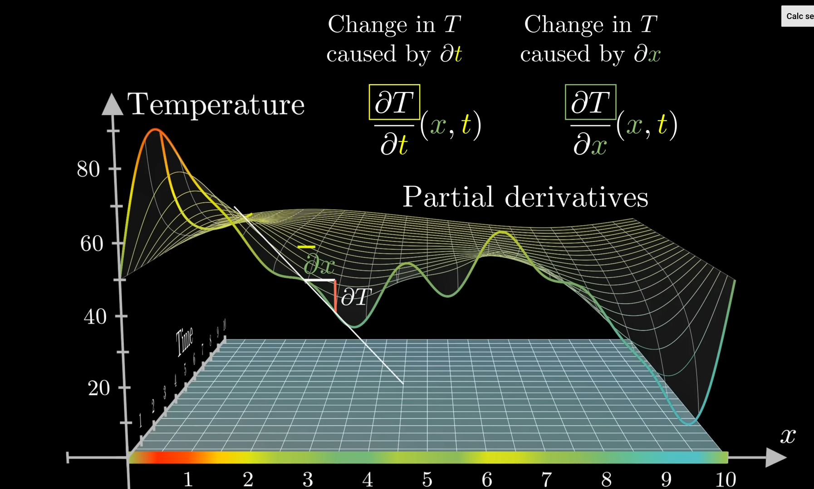

taylor series## Table of contents
## 1.  Các khái niệm liên quan
### 1.1. Smooth Function
Có tính chất **infinitely differentiable**. 
### 1.2. Complex Space
Kí hiệu: $\mathbb{C}$ 
## 2. Các khái niệm chính
### 2.1. Taylor Series
Mục đích: để có một function khác **giống** function đang tìm hiểu. 
ELI5: Biến một đường cong **xấu xí** thành một đường cong **dịu dàng**

Taylor Polynomial: bậc n của hàm $f:\mathbb{R} \to \mathbb{R}$ tại điểm $x_{0}$
$$
T_n(x):=\sum_{k=0}^n\frac{f^{(k)}(x_0)}{k!}(x-x_0)^k
$$

Taylor Series: $f \in \mathbb{C}^{\infty}$
$$
T_\infty(x):=\sum_{k=0}^\infty\frac{f^{(k)}(x_0)}{k!}(x-x_0)^k
$$
is **called** analytic if $f(x)=T_{\infty}(x)$
## 2.2. Partial Differentiation và Gradient
Khác với **Differentiation thông thường**, partial tức là chỉ nói về **một phần** của derivative. 

Lấy ví dụ về sự thay đổi **nhiệt độ** trong không gian: ta sẽ có derivative của **nhiệt độ T** theo **vị trí x** trong không gian, và derivative của **nhiệt độ T** theo **thời gian t**. Như vậy **equation** chỉ có thể nói về một phần của **sự thay đổi**. 

**Gradient** chứa **thông tin** của các partial derivatives dưới dạng **vector**.
$$
\nabla f = 
\begin{bmatrix}
\dfrac{\partial f}{\partial x} \\\\
\dfrac{\partial f}{\partial y} \\\\
\vdots
\end{bmatrix}
$$
### 2.2.1. Các quy tắc
Quy tắc **nhân**: 
$$
\frac{\partial}{\partial x}\left(f(x)g(x)\right)
=\frac{\partial f}{\partial x}g(x)
+f(x)\frac{\partial g}{\partial x}
$$
Quy tắc **cộng**:
$$
\frac{\partial}{\partial x}(f(x) + g(x))
=\frac{\partial f}{\partial x}
+\frac{\partial g}{\partial x}
$$
Quy tắc **dây chuyền**:
$$
\frac{\partial}{\partial x}f(g(x))
=\frac{\partial f}{\partial g}
\frac{\partial g}{\partial x}
$$
### 2.2.2. Gradient của vector-value function
Hay còn được gọi là **Jacobian matrix** của hàm $R^n \mapsto R^m$
$$
\mathbf{J} = \nabla_{\mathbf{x}} \mathbf{f} 
= \frac{d\mathbf{f}(\mathbf{x})}{d\mathbf{x}} 
= \begin{pmatrix} \frac{\partial f(\mathbf{x})}{\partial x_1} & \cdots & \frac{\partial f(\mathbf{x})}{\partial x_n} \end{pmatrix} 
= \begin{pmatrix} \frac{\partial f_1(\mathbf{x})}{\partial x_1} & \cdots & \frac{\partial f_1(\mathbf{x})}{\partial x_n} \\ \vdots & \ddots & \vdots \\ \frac{\partial f_m(\mathbf{x})}{\partial x_1} & \cdots & \frac{\partial f_m(\mathbf{x})}{\partial x_n} \end{pmatrix} 
$$
#### 2.2.2.1. Gradient của vector-value function respect to ma trận 
Xem xét hàm:
$$
f(x)
=\mathbf{A}x,
\quad f \in R^m, \quad A\in R^{m\times n},\quad x\in R^{n}
$$
Ta có:
$$
f=
(\begin{matrix}
\frac{\partial f(\mathbf{x})}{\partial x_1} & \cdots & \frac{\partial f(\mathbf{x})}{\partial x_n} 
\end{matrix})
$$