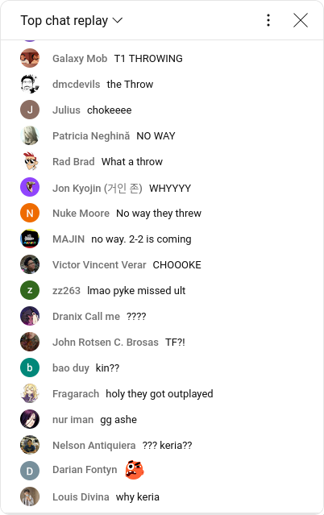
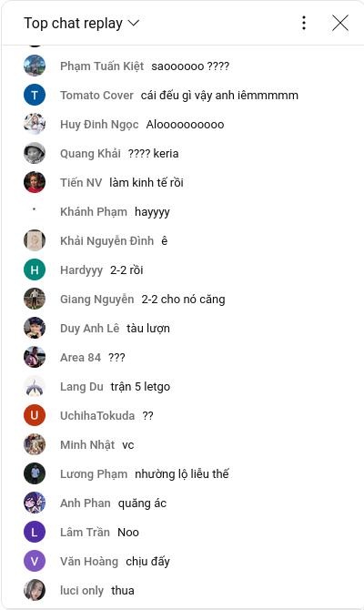

# 1. Questions

# 2. Writing
## 2.1. Ví dụ
Trong một trận đấu căng thẳng giữa T1 và GENG ở lượt bán kết giải WORLDS 2024. Khi mà thời điểm lượng tiền T1 đang hơn GENG khá nhiều bỗng chốc **không còn nữa** sau pha outplay của GENG. Thì đây là kênh chat thế giới:

Mặc dù lượng tiền cả 2 team chỉ mới cân bằng, một số người đã có assumption về việc T1 thua ván này.

Thêm một vài ví dụ trên kênh chat vn:

## 2.2. Assumption thực chất là gì
Unintentionally, Assumption xảy ra khi Self 1 bắt đầu **nghĩ về qúa khứ hoặc tương lai**. Ví dụ: T1 từng thua như vậy nên họ assume T1 sẽ thua tiếp
- Assumption còn đến từ những **judegement** đưa ra bởi Self 1. Ví dụ: T1 đánh tệ thế, thua chắc luôn. Tức trong đầu họ đã label những cách đánh nào gọi là **good** và **bad** dẫn tới assumption.
-> Nên khi một xíu bất lợi xảy ra cho T1, họ sẽ mặc định như vậy. 

Một yếu tố của Assumption đó là **chưa đủ dẫn chứng**. 

Khi mà mình **assume**, Self 1 sẽ bắt **Self 2** làm theo cái assume đó. 

Thật ra vì những assumption nó đều **đến từ Self 1** cả. Giả sử Self 2 cái groove của nó đang là những cái khác mà vì assumption của mình nó buộc phải đi theo hướng đó ??

- [ ] Vậy **enjoy the moment** thiệc sự là gì? Tức set of happening things that match our assumption ?? Không hợp lý, vì **enjoy the moment**.

- [x] **Đừng ráng tìm** xem Self 2 muốn gì 

Tóm lại **Self 1** chỉ nên **aware** of **what is** mà không label **good** hay **bad**, không **assume**. Để **Self 2** làm những gì nó **vốn đã có khả năng** từ lúc mình sinh ra.
